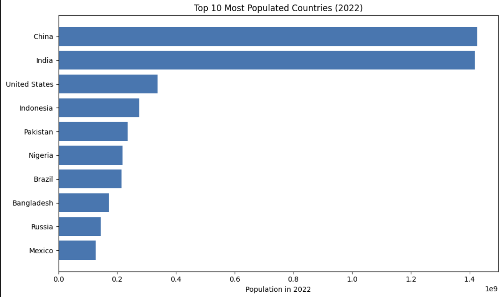

# My First Data Project

This is my first data analytics project using Python and Jupyter.

## Project Structure
- `notebooks/`: Jupyter notebooks
- `data/`: Data files (CSV, Excel, etc.)
- `requirements.txt`: Python libraries used
- `.gitignore`: What to exclude from Git tracking

## Tools
- Python
- Pandas
- Matplotlib
- Jupyter Notebook

## 📊 Top 10 Most Populated Countries (2022)
This chart shows the top 10 most populated countries in 2022 using data from a CSV dataset. Data was cleaned and visualized with pandas and matplotlib.

